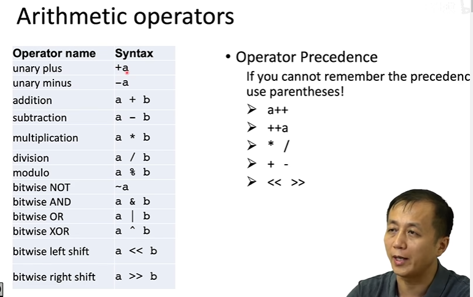
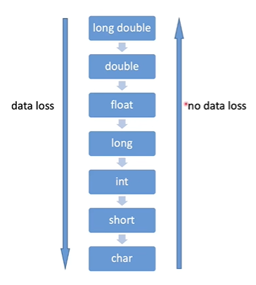

const float PI=3.1415926f; //const类型限定符 定义的变量值不可修改
PI+=1;//error！ 
//PI可以用宏定义也可以用Const

//auto(since C++11) 自动的类型  可以是任意的类型
//初始化的时候是什么类型
auto a=2; //type of int 
auto bc=2.3 //....double
auto c; //error in C++
auto d=a*1.2; //double

auto a=2;//int
//auto初始化以后、类型是int 不会变化。
a=2.3;//结果还是int类型、 2.3先状换int 2  a最后还是2

//C++运算符

~a//~取反   0|1全部取反

a&b //按位运算  相加

a << b  //移位操作
a >> b  //移位运算比+-快

int a=3;
int b=a++; //b=3
int c=++a; //c=5

//数据向下转换会数据丢失
//向上不会

float f1=17 / 5;   //3
float f2=17 / 5.f  //3.4f